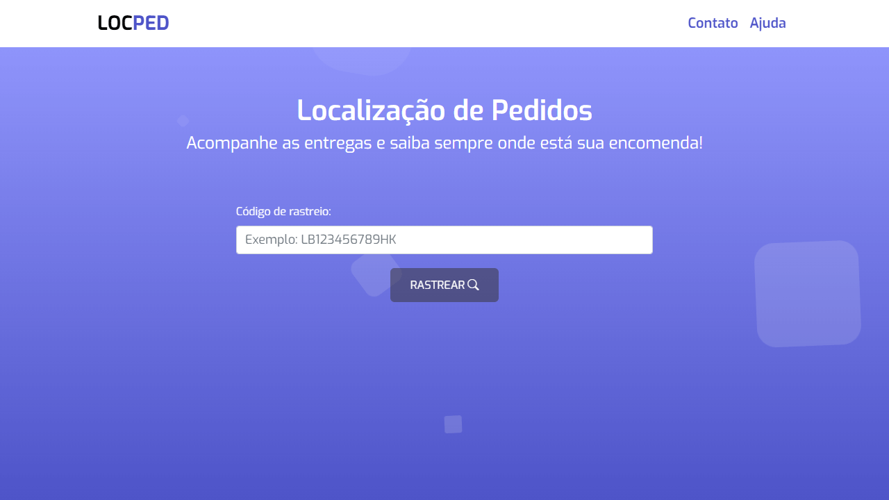
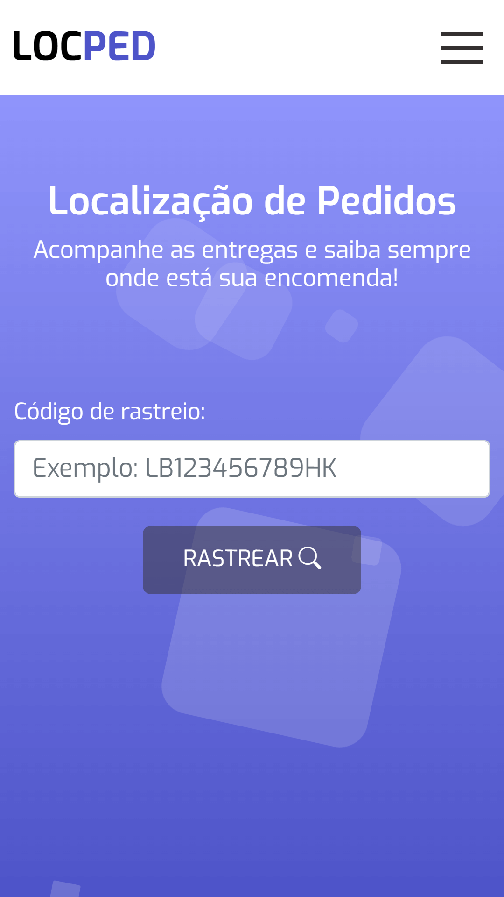

# Locped 🚚
> Projeto construído com Next JS

Locped - localização de pedidos é uma aplicação Web para consulta e acompanhamento de entregas.

Veja a aplicação em funcionamento aqui: https://locped.vercel.app/

## Sobre

O LOCPED começou como um projeto Hobbie para estudo e pela necessidade de um sistema de acompanhamento de entregas personalizado de interesse pessoal.
Depois das primeiras linhas de código, horas de pesquisas e prototipação. O projeto foi ganhando forma e gerando motivação para melhorá-lo constantemente. Atualmente realiza o acompanhamento de entregas apenas dos Correios.

## Features

- Layout totalmente responsivo
- Acompanhamento das entregas feitas pelos Correios
- Linha do tempo com as atualizações da entrega
- Compartilhe rapidamente o link no e-mail
- Compartilhe rapidamente o link no whatsapp
- Pré-implementação de PWA

## Como utilizar?

Insira o código de rastreio (de 13 caracteres) no campo de pesquisa e clique em Rastrear.

Na tela seguinte você verá os dados relacionados a sua entrega. Como:
- Código de rastreio
- Label de status da entrega (muda a cor de acordo com o status)
- Linha do tempo com as atualizações do pacote

Você tem a possibilidade de compartilhar rapidamente o seu link de rastreio para quem você quiser. Tanto por e-mail, quanto pelo whatsapp.

## Tecnologias

Projeto foi construído com as seguintes tecnologias:

- Javascript
- Next JS
- React-bootstrap
- Axios